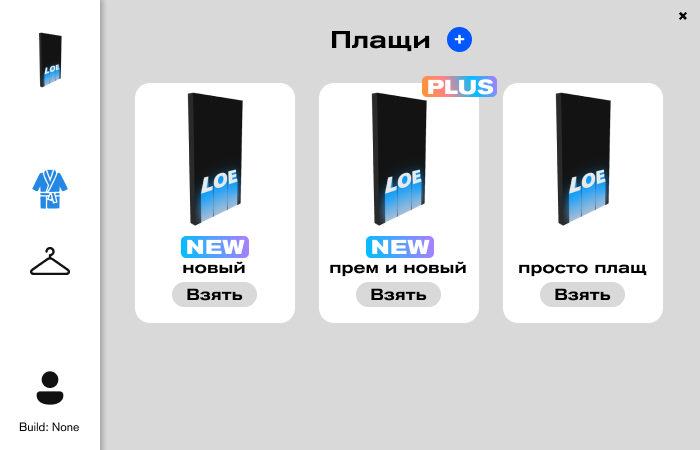

 

  

  <h3 align="center">LoeCosmetics Main</h3>

  

    Public repo for assets and another things
     
     
  

## About The Project

Loecosmetics - minecraft external add-on for capes and cosmetics.

* This is public repo for assets and another things
* This is no src, just assets bro

Of curse, u can use app.

## Usage

Just go to loeage.net and install app
<h4> Tutorial: <h5>
* Go to site
* Download app
* Log-in
* Set capes and cosmetics

## Authors

* **dutixlf** - *Junior Programmer* - [dutixlf](https://github.com/dutixlf/) - *Main tkinter dev*
* **TimonLimon** - *Junior Programmer + Marketing* - [TimonLimon](https://github.com/TimonLimon/) - *Scripting*
